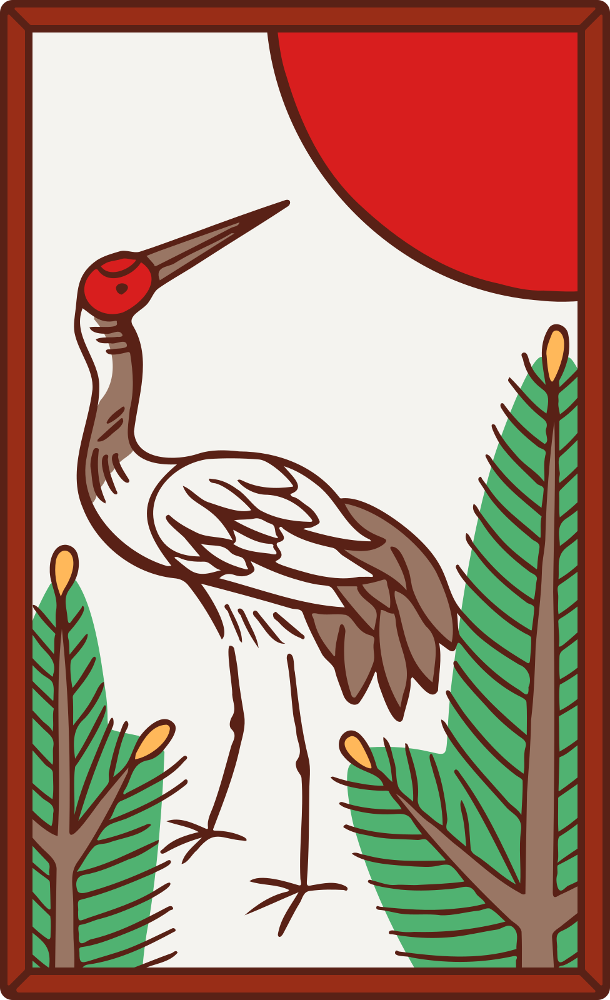
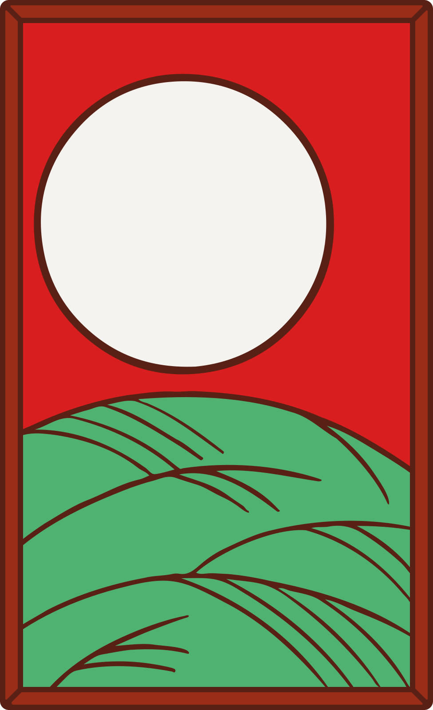
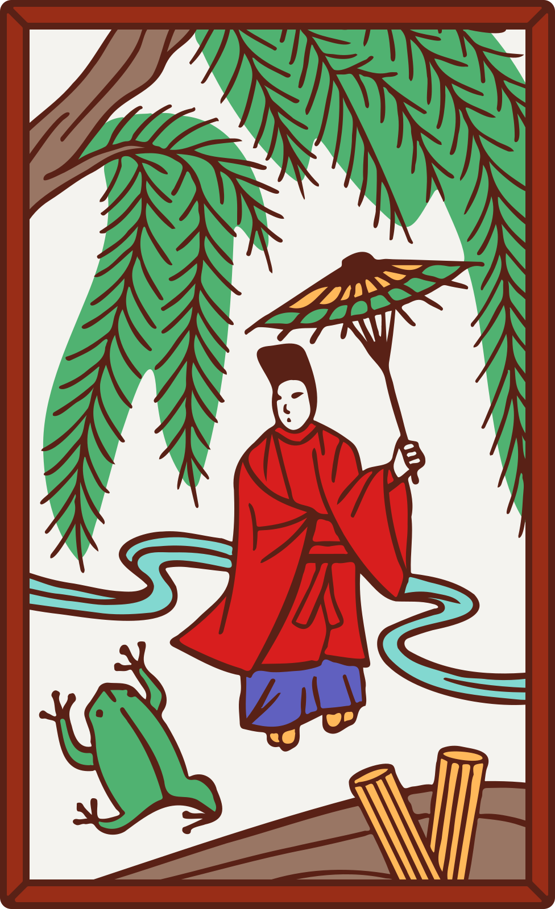
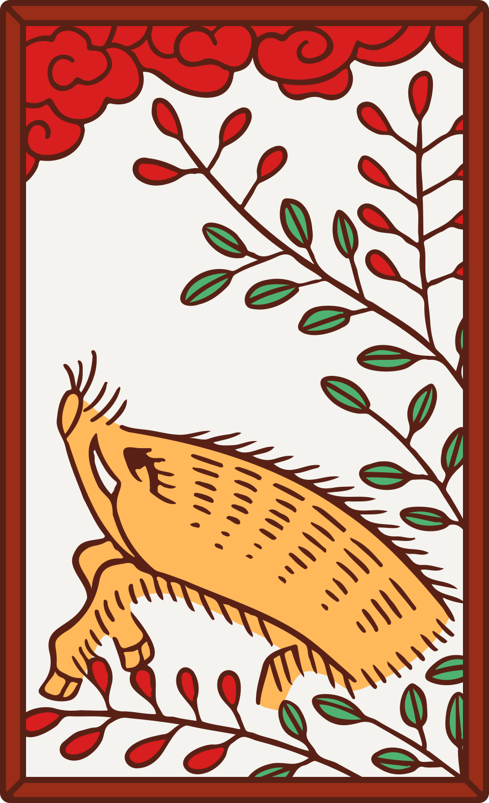
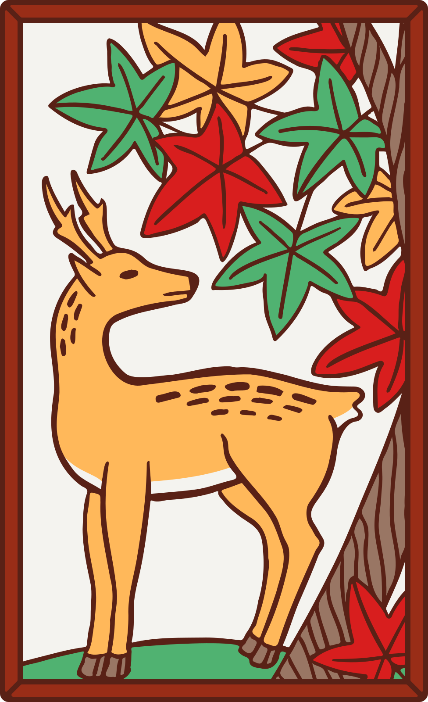
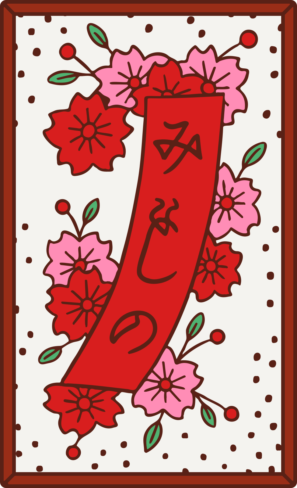
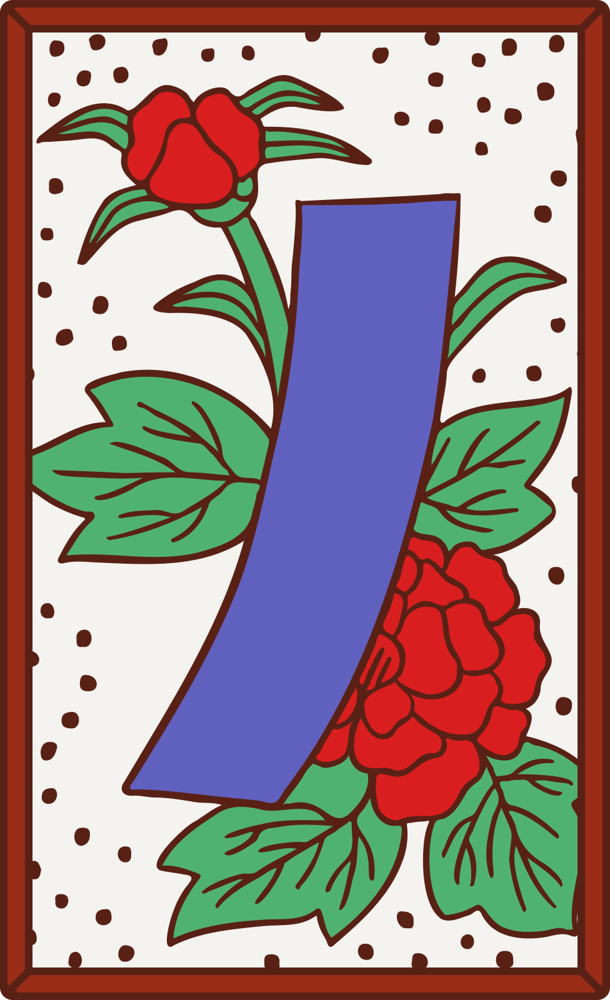
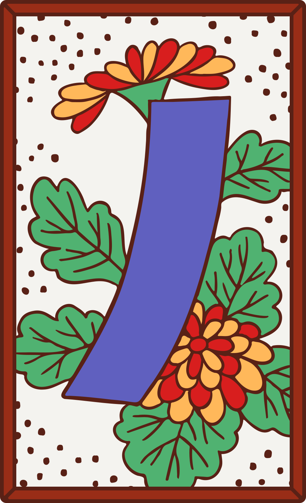

# 花札 Hanafuda

網頁版花牌遊戲for橫版頁面

——手機板的直式網頁我還沒設計啦

目前只做到可以玩一局(一月)的程度

持續更新中...

## Control

- `leftmouse` : press buttons & play cards

- `r` : resize the screen

## Rules

採用[Hanafuda](https://en.wikipedia.org/wiki/Hanafuda)中的[Koi-Koi](https://en.wikipedia.org/wiki/Koi-Koi)玩法，也是最常見的花札玩法。
 

### How to play

見：[花札#規則解說](https://zh.wikipedia.org/wiki/花札#規則解說)

### Yaku(役) List

以下是這個遊戲中的役，劃刪除線的役不採用

| name | condition | score |
| --- | --- | --- |
| 五光 |  | 10 |
| 四光 | 得到不包含「柳間小野道風」之外其餘4張光牌 | 8 |
| 雨四光 | 得到「柳間小野道風」加上另外3張光牌 | 7 |
| 三光 | 得到不包含「柳間小野道風」之外得到其餘4張光牌裡面的3張 | 5 |
| ~~花見で一杯~~ |  | 3 |
| ~~月見で一杯~~ |  | 3 |
| ~~飲み~~ |  | 5 |
| 猪鹿蝶 |  | 5 |
| 赤短 |  | 5 |
| 青短 |  | 5 |
| ~~草~~ |  | 5 |
| タネ | 得到5張任意種牌，每多獲得1張種牌結算時分數+1 | 1(+1) |
| 短冊 | 得到5張短冊牌，每多獲得1張短冊牌結算時分數+1 | 1(+1) |
| カス | 得到10張粕(滓)牌，每多獲得1張粕牌結算時分數+1 | 1(+1) |
| ~~月札~~ | 僅用於12月玩法，收集到當月的4張牌 | 4 |
| 親権 | 雙方牌出完卻都沒有湊成役時，「親」得6文 | 6 |
| ~~手四~~ | 一開始時手牌中即持有一個月份中的四張牌 | 6 |
| ~~喰付~~ | 一開始時手牌中即持有四個月各2張牌 | 6 |

## Source

The images in `img` are licensed under the [Creative Commons](https://en.wikipedia.org/wiki/en:Creative_Commons) [Attribution-Share Alike 4.0 International](https://creativecommons.org/licenses/by-sa/4.0/deed.en) license (CC BY-SA 4.0) by [Louie Mantia](https://commons.wikimedia.org/wiki/User:Louiemantia), sourced from https://en.wikipedia.org/wiki/Sakura_(card_game).