# 花札 Hanafuda

網頁版花牌遊戲for橫版頁面

——手機板的直式網頁我還沒設計啦

持續更新中

## Control

`left mouse` : press buttons & play cards

`r` : resize the screen

## Rules

採用[Hanafuda](https://en.wikipedia.org/wiki/Hanafuda)中的[Koi-Koi](https://en.wikipedia.org/wiki/Koi-Koi)玩法，也是最常見的花札玩法。
 

### How to play

參考：[花札](https://zh.wikipedia.org/wiki/花札)

#### 進行流程

本遊戲為雙人遊戲，第一局前先抽牌決定第一局的「親」（莊家），親先出牌，第二局以後雙方輪流當親先出牌。

每一局開始時發牌，每人8張手牌，8張場牌。

每輪到某方的回合時，那一方就從手牌中拿出一張，若跟場牌有同月份者，就可吃回1張同月份場牌與那張手牌，否則該手牌變成場牌，接下來從山牌（牌堆）中抽出一張，也是跟場牌比對，同月份的必須吃回，若跟場牌有不同配對方式，則可自行選擇要吃哪一張場牌，否則也是作為場牌。

接下來檢視吃回的牌，若有因本次吃進的牌組成「役」（Yaku），則可決定是否結束牌局，若決定繼續（こいこい Koi Koi）或者沒有因本次吃進的牌組成役，則進入對方的回合。

#### 牌局結束

有三種方式：

1. 其中一方喊停（喊停權力如上述）。喊停的一方則可以計算手上所有吃進牌的役，另一方則不能計算役（即沒有分數）。所以什麼時候喊停也是一個重要的策略。
2. 雙方牌都已出完，但兩方都沒能湊成任何役。在這種狀況下，莊家獲得6文（分），即「親權」。
3. 某方最後一張吃進的牌恰好湊成役(此時該方手牌為空)，牌局會強制結束，且該方獲得計算役的權力，另一方不能計算役。

### Card List

| 月份 Month | 植物（花） Pattern(Suit) | 光 Light | 種 タネ Seed | 短冊 Ribbon | 粕（滓） カス Dross |
| --- | --- | --- | --- | --- | --- |
| 1月 睦月 | 松樹 |  | | 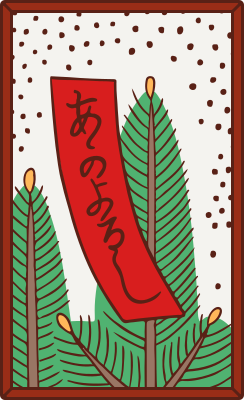 | 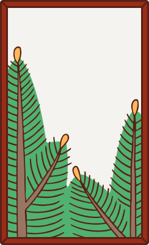 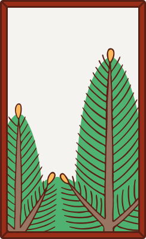 |
| 2月 如月 | 梅花 | | 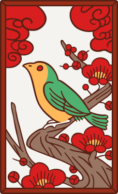 | 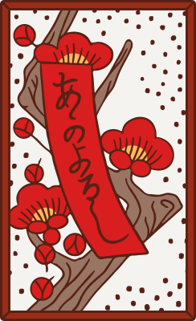 | 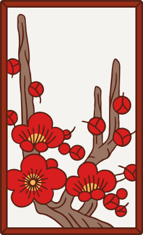  |
| 3月 彌生 | 櫻花 | 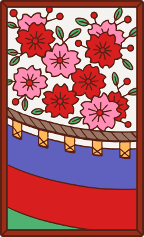 | | 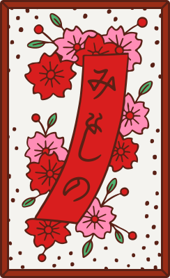 | 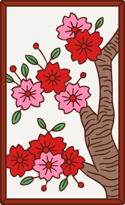  |
| 4月 卯月 | 紫藤 | |  |  | 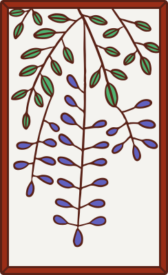 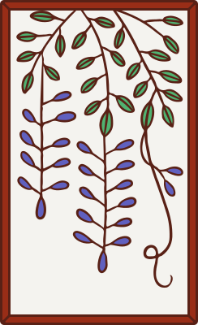 |
| 5月 皐月 | 菖蒲 | | 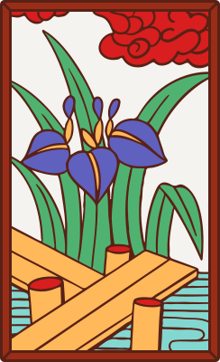 |  | 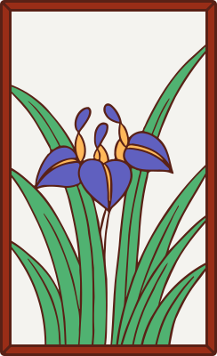 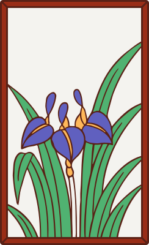 |
| 6月 水無月 | 牡丹 | | 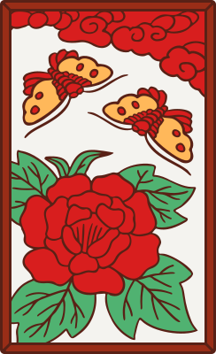 |  | 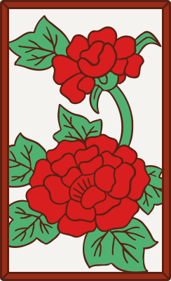 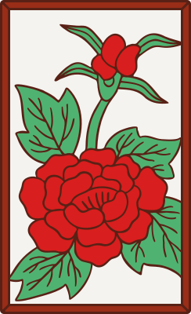 |
| 7月 文月 | 萩 | |  | 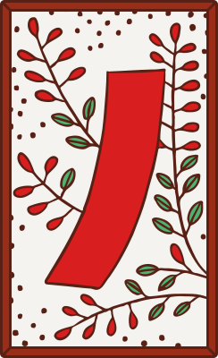 | 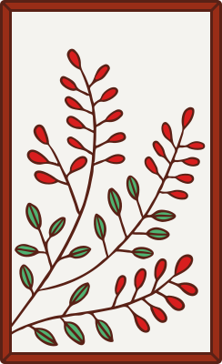 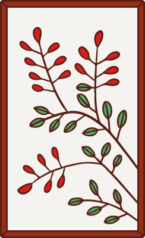 |
| 8月 葉月 | 芒草 | 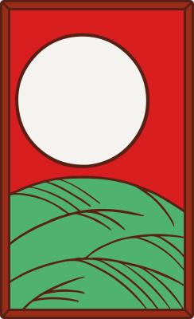 | 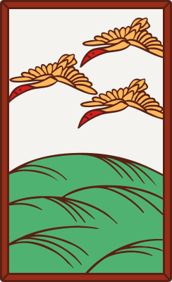 | | 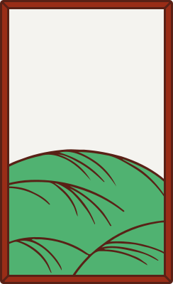 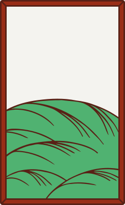 |
| 9月 長月 | 菊花 | | 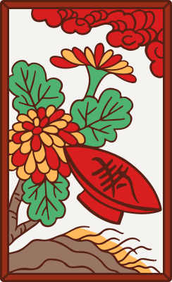 |  | 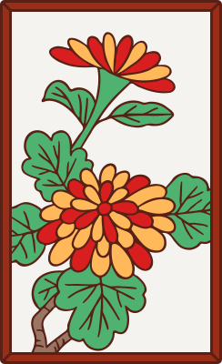 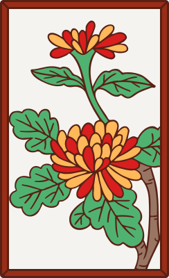 |
| 10月 神無月 | 楓葉 紅葉 | |  | 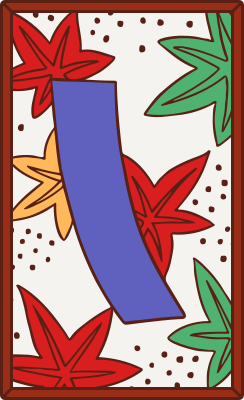 | 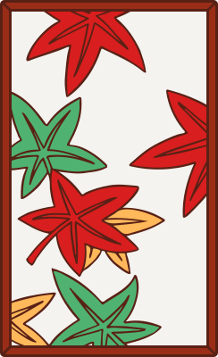 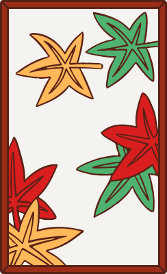 |
| 11月 霜月 | 柳樹（雨） |  | 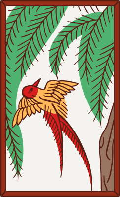 | 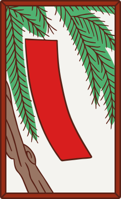 | 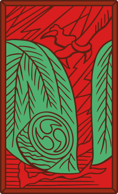 |
| 12月 師走 | 泡桐 | 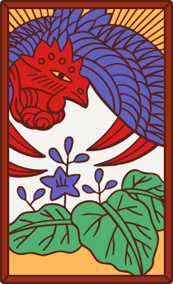 | | | 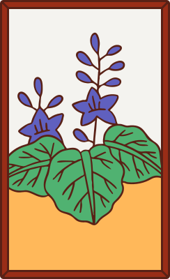 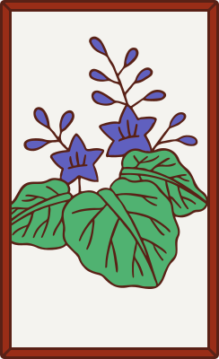 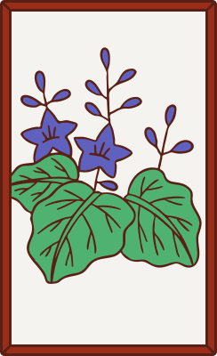 |

### Yaku（役） List

以下是這個遊戲中的役，劃刪除線的役不採用。

| name | condition | score |
| --- | --- | --- |
| 五光 |      | 10 |
| 四光 | 得到不包含「柳間小野道風」之外其餘4張光牌 | 8 |
| 雨四光 | 得到「柳間小野道風」加上另外3張光牌 | 7 |
| 三光 | 得到不包含「柳間小野道風」之外得到其餘4張光牌裡面的3張 | 5 |
| ~~花見で一杯~~ |   | 3 |
| ~~月見で一杯~~ |   | 3 |
| 飲み |    | 5 |
| 猪鹿蝶 |    | 5 |
| 赤短 |    | 5 |
| 青短 |    | 5 |
| ~~草~~ |    | 5 |
| タネ | 得到5張任意種牌，每多獲得1張種牌結算時分數+1 | 1（+1） |
| 短冊 | 得到5張短冊牌，每多獲得1張短冊牌結算時分數+1 | 1（+1） |
| カス | 得到10張粕（滓）牌，每多獲得1張粕牌結算時分數+1 | 1（+1） |
| 月札 | 僅用於12月玩法，收集到當月的4張牌 | 4 |
| 親権 | 雙方牌出完卻都沒有湊成役時，「親」得6文 | 6 |
| ~~手四~~ | 一開始時手牌中即持有一個月份中的四張牌 | 6 |
| ~~喰付~~ | 一開始時手牌中即持有四個月各2張牌 | 6 |

## Sources

The font [Yuji Syuku](fonts/) is is licensed under the SIL Open Font License, Version 1.1., sourced from https://github.com/Kinutafontfactory/Yuji.
The license is copied in [fonts/OFL.txt](fonts/OFL.txt), and is also available with a FAQ at: http://scripts.sil.org/OFL.

The images in `imgs` are licensed under the [Creative Commons](https://en.wikipedia.org/wiki/en:Creative_Commons) [Attribution-Share Alike 4.0 International](https://creativecommons.org/licenses/by-sa/4.0/deed.en) license （CC BY-SA 4.0） by [Louie Mantia](https://commons.wikimedia.org/wiki/User:Louiemantia), sourced from https://en.wikipedia.org/wiki/Sakura_(card_game).